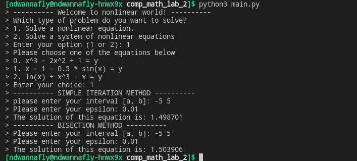
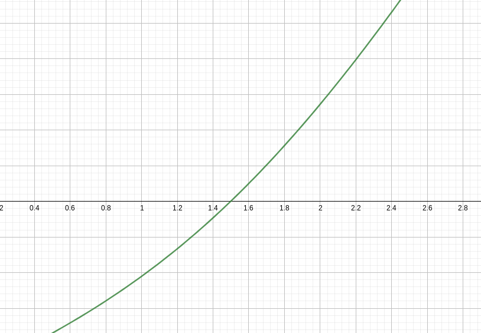
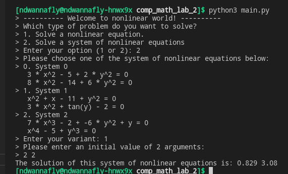
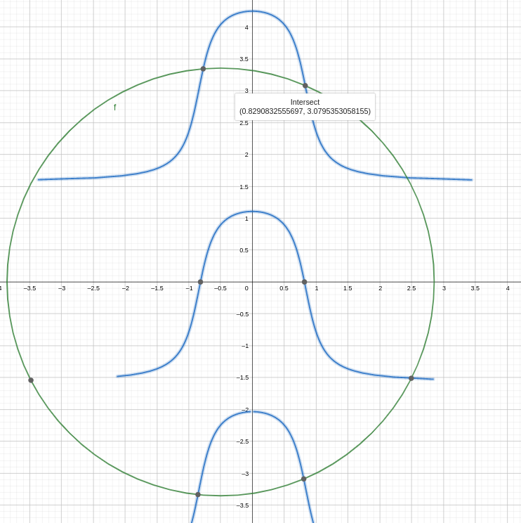

# Description
This repo is implementation of 3 methods for solving non-linear equations and non-linear systems of equations.
1. Non-linear equations
    - Bisection method
    - Simple iteration method

2. Non-linear systems of equation
    - Newton's method
# Learning material
1. Bisection method
    * https://www.youtube.com/watch?v=MlP_W-obuNg
2. Simple iteration method
    * https://www.youtube.com/watch?v=OLqdJMjzib8
3. Newton's method
    * https://www.youtube.com/watch?v=zPDp_ewoyhM
    * https://www.youtube.com/watch?v=p0SBubUfwiI
# Run

